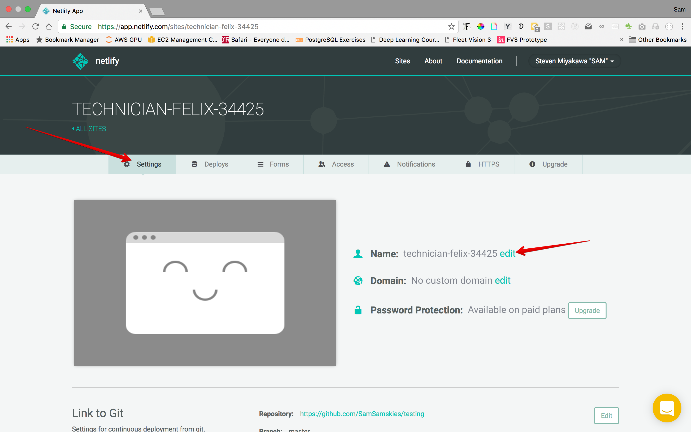

# Deploy React App

1. Go to http://deployreactapp.netlify.com/
2. Click the Deploy to Netlify button
3. Follow instructions and accept authorizations that popup
4. Sit back for about a minute while Netlify builds and deploys your React app
5. Optional: Edit settings such as the name of your app

6. Verify deployment of your React app by going to NAME_OF_YOUR_APP.netlify.com
7. Dance

Changes pushed to the master branch of your app will automatically be deployed to Netlify. BOOM!
